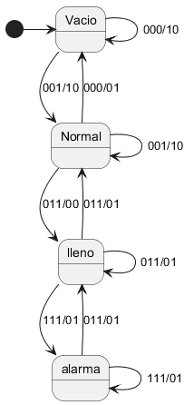

Un tanque de agua abierto por la parte superior dispone de tres sensores de detección de llenado (A, B, C) que determinan 4 posibles niveles de llenado (VACÍO, NORMAL, LLENO, ALARMA). El  nivel del tanque se controla mediante dos válvulas (E, entrada y S, salida).
En condiciones de llenado normal, las válvulas E y S se encuentran abiertas.
Si el líquido llega al nivel de vacío, se  cierra la válvula de salida y se mantiene abierta la de entrada. Si el líquido llega al nivel de lleno, se cierra la válvula de entrada y se mantiene abierta la de salida. Si por cualquier circunstancia, por ejemplo lluvia, se llegara al nivel de alarma, se deberá cerrar la válvula de entrada y abrir la de salida. Esta situación se mantendrá hasta que el tanque llegue al estado de vacío.

