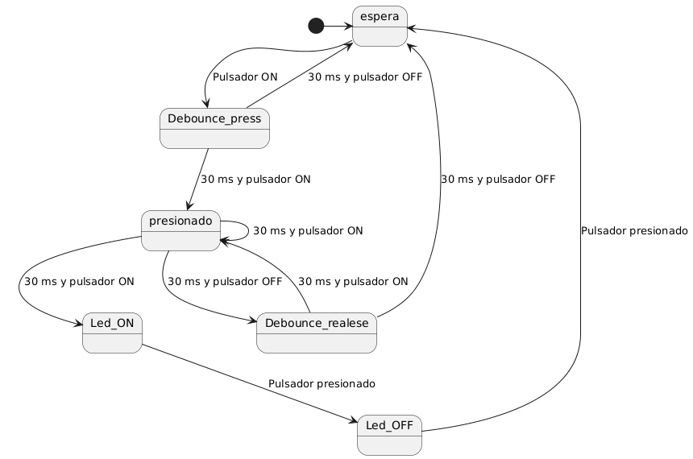

Ahora piensa cómo utilizarías los ejemplos anteriores para crear una MEF, que tenga como propósito manejar el pulsador (con la MEF para antirrebotes) y además, utilizar dicho pulsador, para encender y apagar el LED de la MEF 2.

