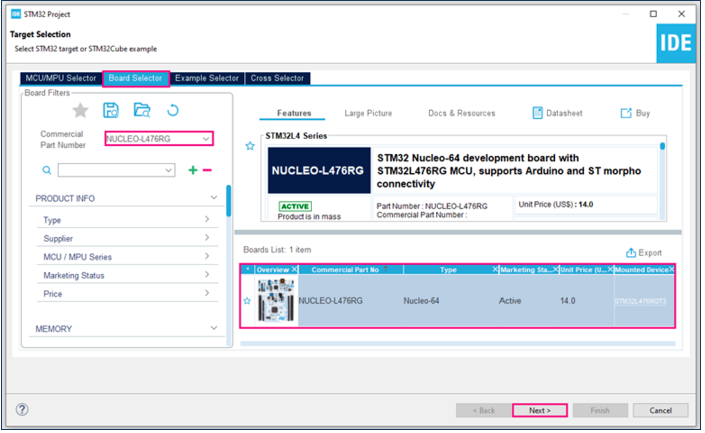
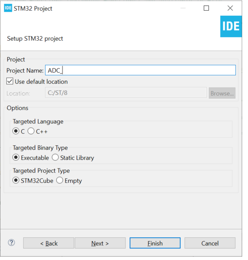
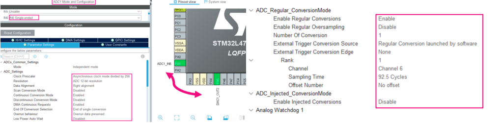
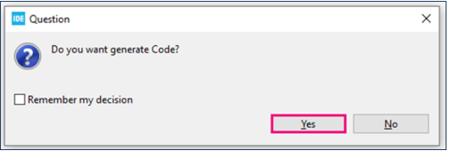

## Actividad

#### 1. Vas a implementar un ejercicio tomado directamente de la página de ST. [**Link del ejercicio**](https://wiki.st.com/stm32mcu/wiki/Getting_started_with_ADC).
#### 2. Vas a reemplazar la entrada del DAC del ejercicio por un sensor analógico. Puede ser una resistencia variable con la luz, un sensor de temperatura o cualquiera que tengas a disposición. **Recuerda que debe ser analógico**. 
#### 3. Vas a enviar los datos convertidos a través de la interfaz serial al computador para poder observarlos en una consola.

## Desarrollo
### 1. Configuracion del ADC como output

Se creo el pryecto utilizando el microprocesado stm32f407vet6.

lo seleccionamos en el apartado que muestra la imagen.

Despues de seleccionado el microprocesador en el que vamos a trabajar creamos el proyecto y se le configura el nombre.

Se selecciona un puerto y se le configura el ADC dependiendo de lo que necesitemos, en nuestro caso fue una lectura de datos continua.

Despues de configurar el pin SE presiona **Ctrl+S** para crear el proyecto.

