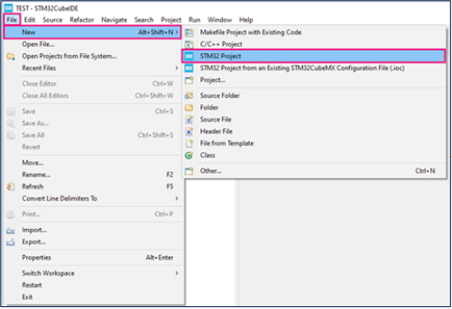

## Actividad

#### 1. Vas a implementar un ejercicio tomado directamente de la página de ST. [**Link del ejercicio**](https://wiki.st.com/stm32mcu/wiki/Getting_started_with_ADC).
#### 2. Vas a reemplazar la entrada del DAC del ejercicio por un sensor analógico. Puede ser una resistencia variable con la luz, un sensor de temperatura o cualquiera que tengas a disposición. **Recuerda que debe ser analógico**. 
#### 3. Vas a enviar los datos convertidos a través de la interfaz serial al computador para poder observarlos en una consola.

## Desarrollo
### 1. Configuracion del ADC como output



Se creo el pryecto utilizando el microprocesado stm32f407vet6.


lo seleccionamos en el apartado que muestra la imagen.


Despues de seleccionado el microprocesador en el que vamos a trabajar creamos el proyecto y se le configura el nombre.


Se selecciona un puerto y se le configura el ADC dependiendo de lo que necesitemos, en nuestro caso fue una lectura de datos continua.


Despues de configurar el pin se guarda el programga y automaticamente nos dara la opcion de generar el codigo.  
A continuacion se muestran las partes que se cambiaron del codigo.

```
/* Includes ------------------------------------------------------------------*/
#include "main.h"
#include <stdio.h>
#include <string.h>
```

Como primera parte en el codigo se usaron estas librerías `#include "main.h"`, `#include <stdio.h>` y `#include <string.h>`. `main.h` es un archivo de encabezado personalizado que contiene definiciones de pines, prototipos de funciones y macros específicas del proyecto. `stdio.h` proporciona funciones estándar de entrada/salida, como `printf()` y `sprintf()`, útiles para depuración y envío de datos a través de UART.`string.h` permite la manipulación de cadenas y memoria mediante funciones como `strlen()`, `strcpy()`, `strcmp()`, `memset()` y `memcpy()`, lo cual es esencial para el manejo de datos en aplicaciones embebidas.

```
/* USER CODE BEGIN PV */
uint32_t value_adc;
/* USER CODE END PV */
```

La sección `/* USER CODE BEGIN PV */` y `/* USER CODE END PV */` en STM32CubeIDE está destinada a que el usuario defina variables privadas (`PV` = Private Variables) que serán utilizadas exclusivamente dentro del archivo en el que se declaran. En este caso, `uint32_t value_adc;` es una variable de 32 bits sin signo que se utiliza para almacenar el valor convertido por el ADC (Convertidor Analógico-Digital), permitiendo capturar datos analógicos, como los provenientes de sensores, y procesarlos digitalmente en el microcontrolador.

```
  /* USER CODE BEGIN 2 */
  HAL_ADC_Start(&hadc1);
  /* USER CODE END 2 */
```

La sección `/* USER CODE BEGIN 2 */` y `/* USER CODE END 2 */` en STM32CubeIDE permite insertar código personalizado que se ejecuta después de la inicialización del sistema y antes del bucle principal (`while (1)`), garantizando que no se sobrescriba si se vuelve a generar el código con STM32CubeMX. La instrucción `HAL_ADC_Start(&hadc1);` inicia la conversión del ADC (Convertidor Analógico-Digital) usando el periférico `hadc1`, permitiendo comenzar la captura de señales analógicas que serán convertidas a datos digitales por el microcontrolador.

```
 /* USER CODE BEGIN 3 */
	  while (1)
	  {
	    HAL_ADC_Start(&hadc1);  // Inicia la conversión manualmente

	    if (HAL_ADC_PollForConversion(&hadc1, 10) == HAL_OK)
	    {
	      value_adc = HAL_ADC_GetValue(&hadc1);
	      printf("ADC Value: %lu\r\n", value_adc);
	    }

	    HAL_Delay(100);  // Retardo entre muestras
	  }
  }
  /* USER CODE END 3 */
```

La sección `/* USER CODE BEGIN 3 */` y `/* USER CODE END 3 */`. En este caso, el código inicia la conversión del ADC con `HAL_ADC_Start(&hadc1)` y luego espera hasta que la conversión termine usando `HAL_ADC_PollForConversion(&hadc1, 10)`, donde el número `10` representa el tiempo máximo de espera en milisegundos. Una vez que la conversión es exitosa (indicado por `HAL_OK`), el valor digital convertido se obtiene con `HAL_ADC_GetValue(&hadc1)` y se almacena en la variable `value_adc`. Luego, se imprime este valor a través de `printf("ADC Value: %lu\r\n", value_adc);` y, finalmente, se introduce un retardo de 100 ms con `HAL_Delay(100)` antes de volver a iniciar el ciclo, permitiendo una medición periódica de la señal analógica.

```
int _write(int file, char *ptr, int len) {
    for (int i = 0; i < len; i++) {
        ITM_SendChar((*ptr++));
    }
    return len;
}
```

La función `int _write(int file, char *ptr, int len)` es una implementación personalizada de la función `write()`, que es parte de la interfaz estándar de C para manejar operaciones de escritura. En sistemas embebidos, especialmente en microcontroladores, se usa para redirigir la salida estándar (como `printf`) a un periférico específico, en este caso, el puerto ITM. Esta función recibe tres parámetros: `file` (que no se utiliza en este contexto), `ptr` (un puntero al inicio de la cadena de caracteres que se desea imprimir), y `len` (la longitud de la cadena). La función recorre cada carácter de la cadena (`*ptr++`) y lo envía uno por uno a través de `ITM_SendChar()`, que es una función específica para enviar datos al puerto ITM. Finalmente, la función retorna `len`, que indica el número de caracteres escritos, permitiendo que funciones como `printf` funcionen correctamente en un entorno sin consola, pero con la capacidad de ver los resultados a través de la traza del microcontrolador.


Es importante cofigurar bien el debugger activando el SWD y el SWV esto con el fin de poder visualizar los datos en el serial.


De la misma forma activamos el SWV ITM Data Console que nos servira como serial.


Por ultimo activamos el puerto 0 para poder visualizar los datos